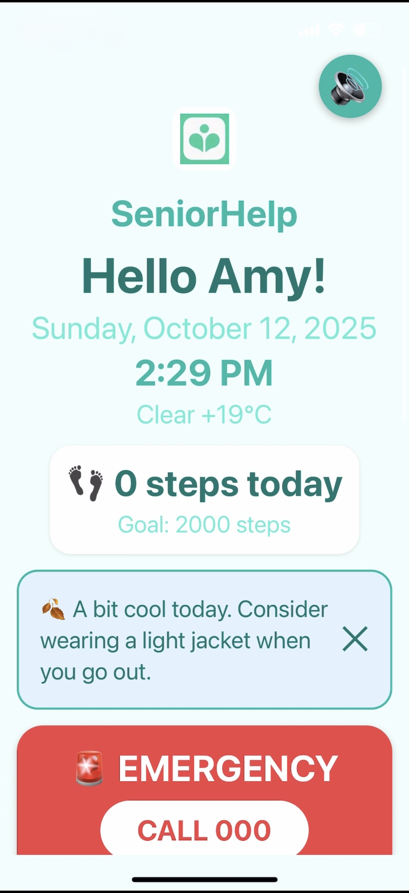
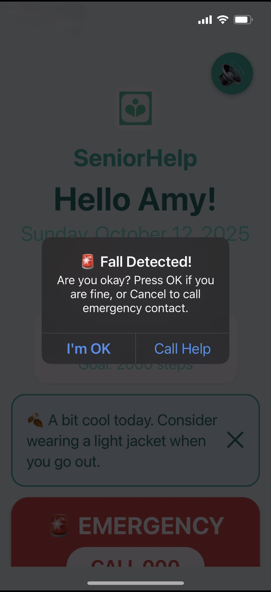
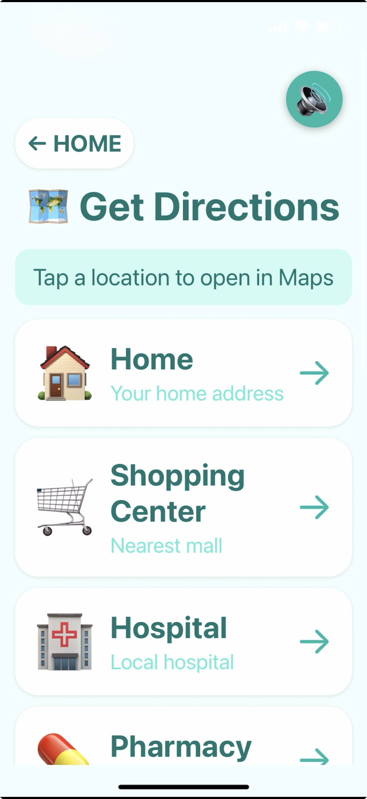
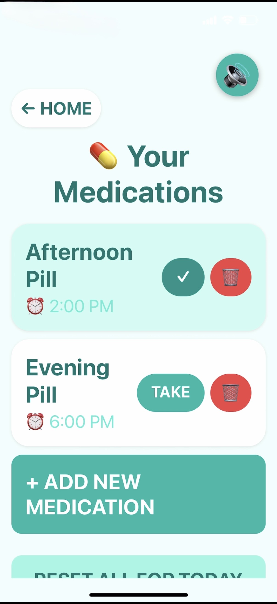

# SeniorHelp

SeniorHelp is a mobile application designed to support elderly users through simple, reliable, and safety-focused features. The project explores how technology can assist healthcare-related needs while prioritising trust, accessibility, and ease of use.

## Purpose
The app was built to address common challenges faced by elderly users, such as navigating technology during emergencies or accessing frequently used locations. The focus is on reducing cognitive load and ensuring dependable behaviour in critical situations.

## Key Features
- **Fall Detection Logic**: Identifies potential falls and triggers appropriate responses
- **Emergency Calling**: Enables quick access to emergency contacts
- **Simplified Directions**: Provides easy access to frequently visited locations
- **Medication Reminders**: Supports users in managing daily medication routines
- **Accessible Interface**: Designed with clarity and ease of use in mind

## Screenshots

| Home | Fall Detection |
|------|---------------|
|  |  |

| Directions | Medication |
|-----------|------------|
|  |  |

## Tech Stack
- React Native (Expo)
- JavaScript / TypeScript
- Firebase (if applicable)

## Notes
This is a personal project developed to explore product-oriented engineering in a healthcare context, with an emphasis on reliability, user trust, and real-world usability.
